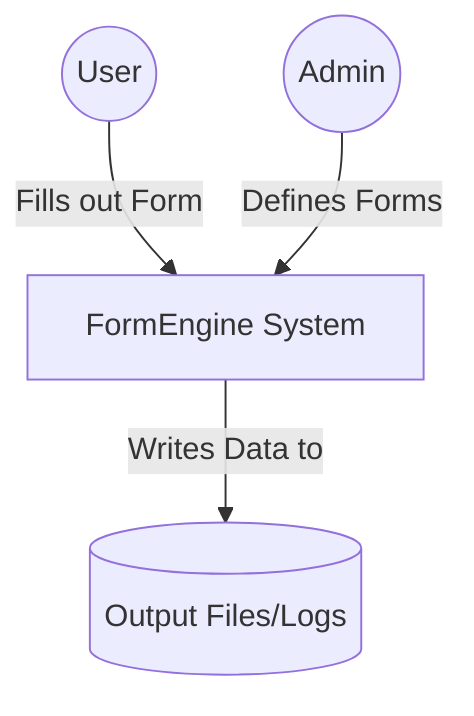
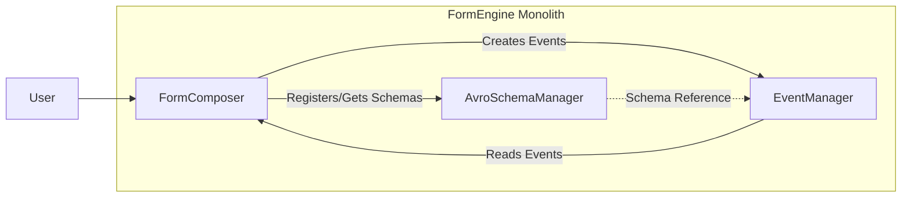
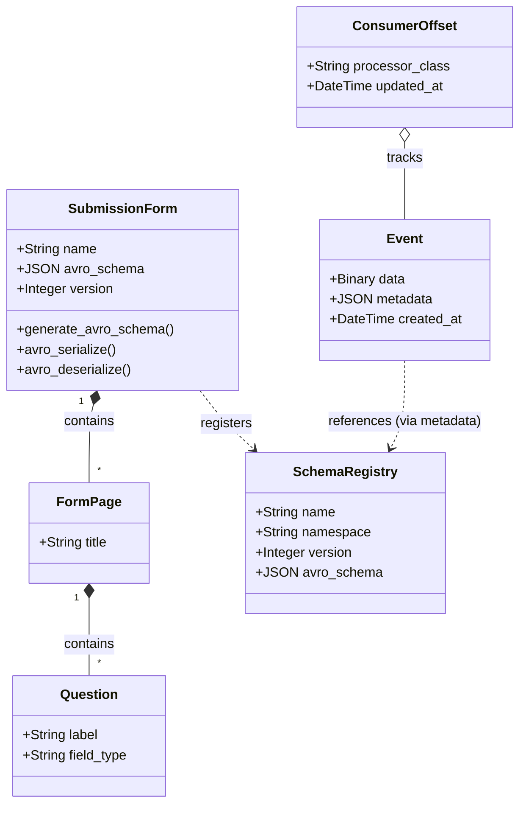
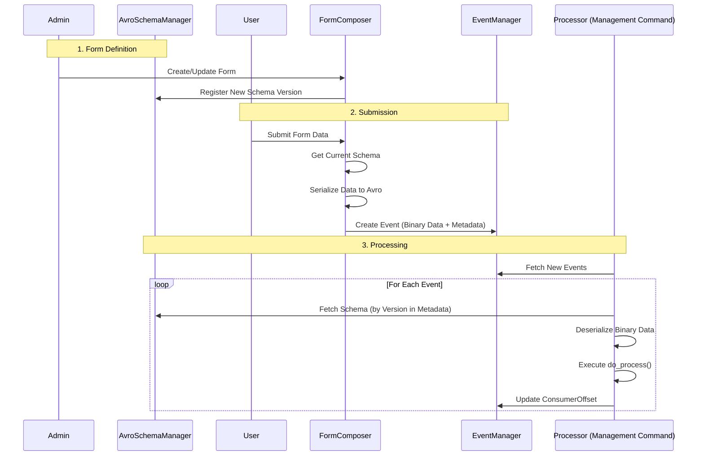

# FormEngine Spike Experiment

How to capture a typed form submission as an immutable event but also allow evolution of the form definition over time? How to support event driven audit log in a Django application?

---

This project is a spike experiment for a dynamic form engine using event sourcing and Avro serialization. It allows for dynamic form creation, schema-driven serialization, and asynchronous event processing.

## Architecture (C4 Model Style)

### Level 1: System Context
The FormEngine system allows Users to fill out dynamic forms. Submissions are captured as events, which are then processed by various Processors for downstream tasks (e.g., logging, file generation).

### Level 2: Containers
The system is built as a Django 'modulith' containing three primary Django Apps:

1.  **FormComposer**: The user-facing application for defining and rendering forms.
2.  **EventManager**: The event store that records all form submissions as immutable events.
3.  **AvroSchemaManager**: A central registry for Avro schemas generated from form definitions.

---

## Django Apps & Data Models

### 1. FormComposer
Responsible for the structure of forms and the logic to serialize submissions.

*   **Models**:
    *   `Question`: Individual form fields (currently supports text).
    *   `FormPage`: A collection of Questions.
    *   `SubmissionForm`: The top-level form entity. Links to `FormPage`s.
    *   `SubmissionFormPage` / `FormPageQuestion`: Junction tables for ordering.
*   **Key Logic**:
    *   Automatically generates an **Avro Schema** when a `SubmissionForm` or its pages are saved.
    *   Caches the current schema version on the form.
    *   Handles serialization of POST data into Avro bytes.

### 2. EventManager
The backbone of the event-driven architecture.

*   **Models**:
    *   `Event`: An immutable record of a form submission. Stores data as `BinaryField` (Avro bytes) and `metadata` as JSON (e.g., `form_id`, `processor_class`).
    *   `ConsumerOffset`: Tracks the last processed `Event` for each specific `Processor` class to ensure reliable, ordered consumption.

### 3. AvroSchemaManager
Ensures data consistency across the lifecycle of an event.

*   **Models**:
    *   `SchemaRegistry`: Stores historical versions of Avro schemas. Each entry includes `name`, `namespace`, `version`, and the `avro_schema` JSON.
*   **Key Logic**:
    *   Allows processors to look up the exact schema version used when an event was originally produced, ensuring safe deserialization even if the form definition has since changed.

---

## Data Flow

1.  **Form Definition**: An admin creates a `SubmissionForm` in the Django Admin. On save, a new Avro schema is generated and stored in the `SchemaRegistry`.
2.  **Submission**: A user submits a form. The `submit_form` view:
    *   Retrieves the current schema for the form.
    *   Serializes the POST data into Avro binary format.
    *   Creates an `Event` record containing the binary data and metadata.
3.  **Processing**: The `process_events` management command is executed:
    *   It identifies all active `Processor` subclasses (e.g., `PetProcessor`).
    *   Each processor checks its `ConsumerOffset` to find new events.
    *   For each new event:
        *   The processor retrieves the original schema from `SchemaRegistry`.
        *   The binary data is deserialized back into a dictionary.
        *   `do_process()` is called (e.g., `PetProcessor` writes the data to a timestamped text file).
    *   The `ConsumerOffset` is updated.

---

## Technical Stack
*   **Language**: Python 3.13
*   **Framework**: Django
*   **Serialization**: Avro (via `fastavro`)
*   **Frontend**: HTMX (for multi-page form navigation)
*   **Database**: SQLite (default for spike)

## Future Roadmap (Todo)
*   Add transactions for consumers to ensure atomic processing and offset updates.
*   Implement a dead-letter queue for failed events.
*   Integrate Django Channels for real-time updates.
*   Enhance consumer exception handling and retry logic.
*   Integrate metrics and structured logging.
*   Evaluate dedicated queue backends (e.g., `pgmq` or `pgqueuer`).
