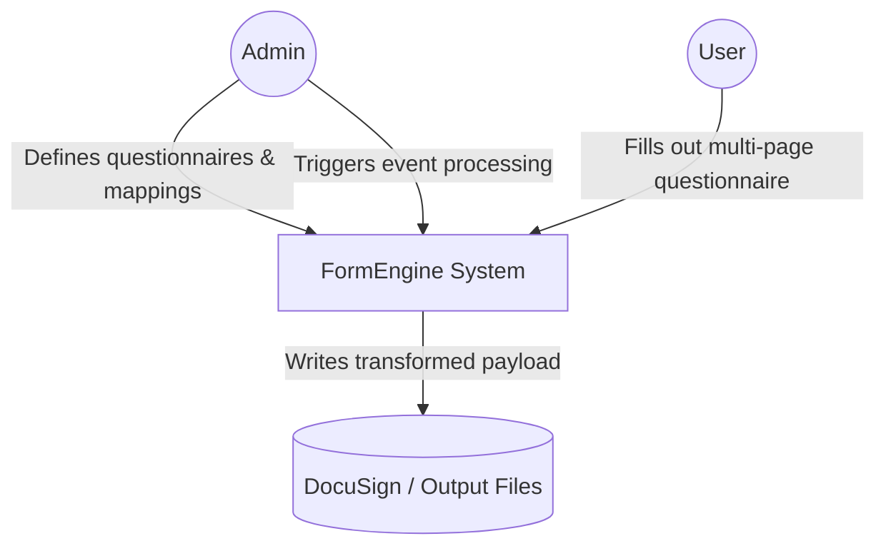
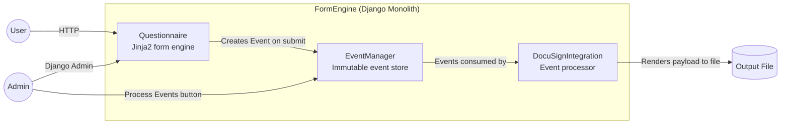
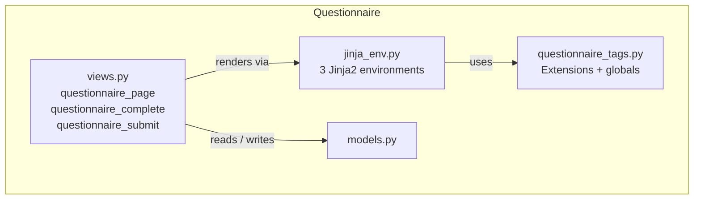
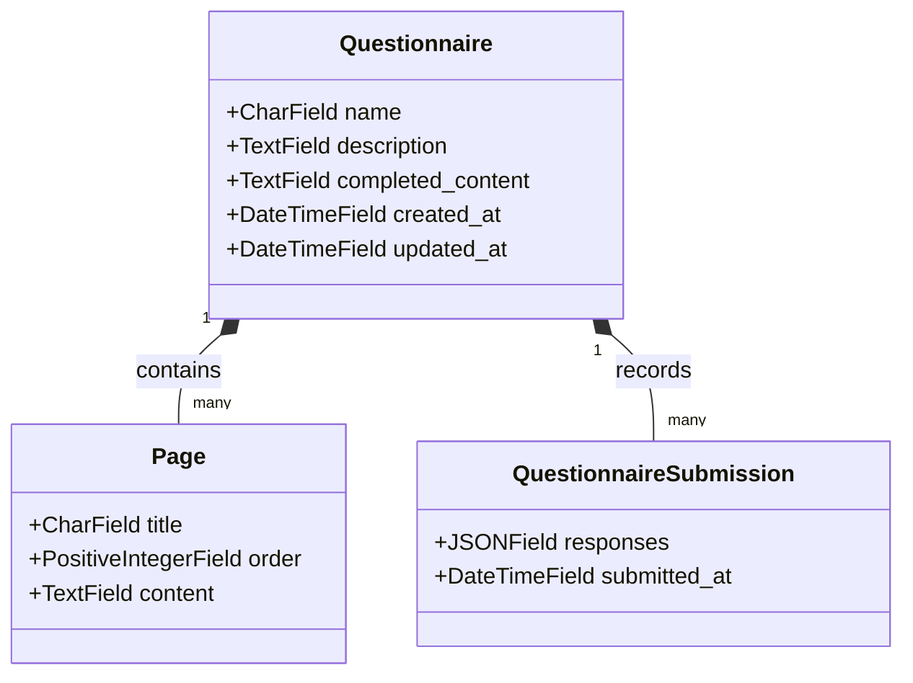
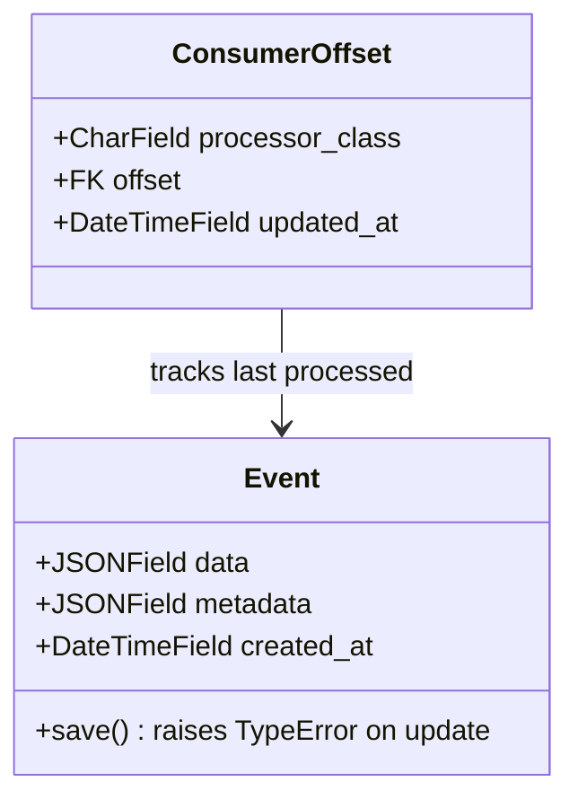
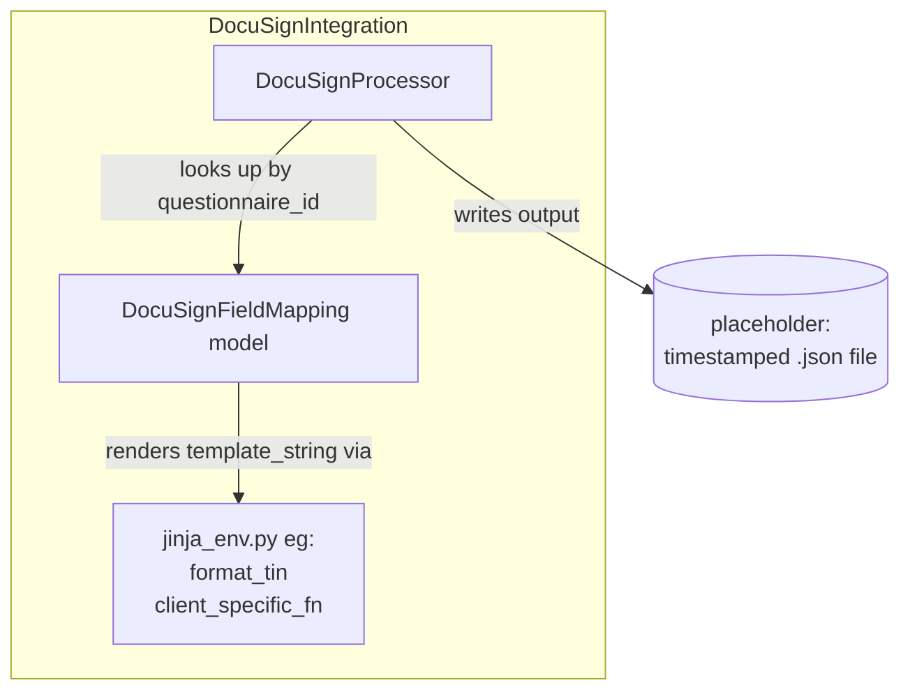
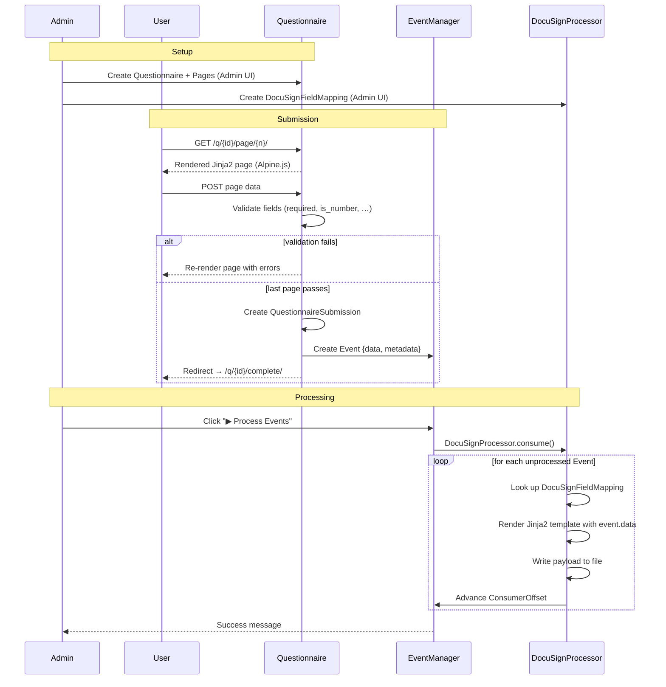

# FormEngine

A spike experiment for a dynamic form engine using **event sourcing**. Explores how to capture typed form submissions as immutable events while allowing form definitions to evolve over time, and how to support an event-driven audit log and downstream integrations in a Django application.


## Introduction

* Can data collection forms be configurable?: 
* Can they be easier to maintain and extend?
* This could be a data models or a DSL, or YAML... but I felt they're all a bit limiting. So why not use a form of HTML? Fortunately Django has a super templating/ component system which means we can define a form like this:
 
```html

   {{ answer("happy", "Happy") }}
   {{ answer("sad",   "Sad") }}


        {{ text("why", "Why?", placeholder="Anything else?") }}

```

* This shows the first question and if the answer is 'sad' it shows the user the second question. 
* Of course, this can support all kinds of fields and validators and error messages so on. 
* These 'template tags' (eg the stuff in a `````` are a python function + a fragment of HTML so they can do anything.eg: they can do database or API calls;
* These html fragments could initiate an island of react interactivity. 
* So we can build a well tested library of these form components and compose them for each client/form. 
* When the form is complete then the spike uses the same idea to format and transform the json for sending to Docusign:
```{
  "mood_in_docusign": "{{ mood }}",
  "tin": "{{ tin | format_tin }}",
  "need_vacation": " Take a break"
}
```

* Now this takes that raw form data and maps our form variable to the label in the docusign 
* The 'tin' has a filter: so we can do a transformation on the data. (add dashes say, or a default or whatever)
* The jinja template system supports logic which is handy

### Obstacles:

* Change is hard. 
* Obvs this moves the complexity from one place to another: it'll still be a job to make all the forms 
* However it's more transparent - and we're composing the forms, which makes them more testable and editable 
* client specific behaviours: more of a component in the flow rather than a big ball of mud 
* Can try a real form to see if it works in real life. 
* Give a demo & get some buy in from stakeholders 
* Examine if it'll work on the most difficult scenarios: Don't want surprises.
 

---

## C4 — Level 1: System Context



---

## C4 — Level 2: Containers

The system is a Django **modulith** — a single process composed of focused Django apps.



| App | Responsibility |
|---|---|
| **Questionnaire** | Multi-page Jinja2 form rendering, validation, submission |
| **EventManager** | Immutable event log; offset tracking per processor |
| **DocuSignIntegration** | Transforms event data via Jinja2 mappings; writes DocuSign payload |


---

## C4 — Level 3: Components

### Questionnaire



**Models**



**Jinja2 Environments**

Jinja is used in three contexts:
* Rendering the questionnaire page
* Transforming the supplied submission data into a JSON payload
* Rendering the completion page

| Environment | Purpose |
|---|---|
| `environment` | Full rendering with custom extensions — used for page HTML output |
| `required_fields_env` | Collecting pass — extracts `{field: [validators]}` without emitting HTML |
| `completed_content_environment` | Simple environment for the post-submission completion page |

**Template Tags & Globals** (available inside `Page.content`: in the questionnaire page)

| Tag / Global | Description |
|---|---|
| `` | Renders a radio-button group |
| `` | Renders a checkbox group |
| `` | Shared Alpine.js scope; enables cross-field `x-show` |
| `` | Conditionally shows a block |
| `{{ answer("val", "Label") }}` | Option inside `` |
| `{{ multianswer("val", "Label") }}` | Option inside `` |
| `{{ text("name", validators=["required","is_number"]) }}` | Free-text input with validators |
| `{{ show("field_name") }}` | Emits current stored value |
| `{{ include_questionnaire(page_id) }}` | Inline-renders another `Page` by PK |
| `{{ complex_function("a","b","c") }}` | Joins args with `-`, repeats 6× |

---

### EventManager



- `Event` is **immutable** — `save()` raises `TypeError` if the record already exists.
- `metadata` carries context: `source`, `questionnaire_id`, `questionnaire_name`, `submission_id`.
- The Django Admin includes a **▶ Process Events** button on both the `Event` and `ConsumerOffset` changelists, which calls `DocuSignProcessor.consume()` directly.

---

### DocuSignIntegration
There could be multiple processors, each with their own `ConsumerOffset` but in this spike sharing the `Event` model. Not implemented: Just one consumer 



---

## Data Flow



---

## Tech Stack

| Layer | Technology                                        |
|---|---------------------------------------------------|
| Language | Python 3.13                                       |
| Framework | Django 6                                          |
| Package manager | `uv`                                              |
| Database | SQLite (spike default)                            |
| Templates | Jinja2 (eg template tags + Alpine.js integration) |
| Frontend | Alpine.js + HTMX + Tailwind CSS                   |
| Admin extras | `django-guardian`, `django-json-widget`           |

---

## Running Locally

```bash
uv run manage.py migrate
uv run manage.py runserver 8002
```

Process events from the command line:

```bash
uv run manage.py process_events
```

Or use the **▶ Process Events** button in the Django Admin on the Event / ConsumerOffset changelist pages.

---

## Implementation Notes

- forms: retain previous incomplete submissions,
- pages animations
- form-level validation & messages  (admin managed)
- field-level validation & messages (admin managed)
- each form flow is configured explicitly
- No FE/BE API mismatch
- No logic in the FE: All business logic is composable.
- Completion page can trigger actions (eg: logging / follow-up email etc)
- forms (and partial forms) can be included into multiple questionnaires
- contingent form fields: shown only given fields if other fields are filled in
- later questions contents can be based on previous answers
- Supports 'islands of react' if required for complex field type.
- supports complex/client specific data transformations.
- maintainable & extensible
- audit trail and easier to reason about
- Simple HTML: mobile-friendly, printable, accessible, etc.
- Should support multilingual forms (tbc)
- can be gradually deployed

## Known Limitations

Event processing is a spike. Hence:
- Only `DocuSignProcessor` is wired up
- No transactions around consume + offset update (non-atomic).
- No dead-letter queue or retry logic for failed events.
- SQLite is unsuitable for concurrent consumers; swap for PostgreSQL + `pgmq`/`pgqueuer` for production.
