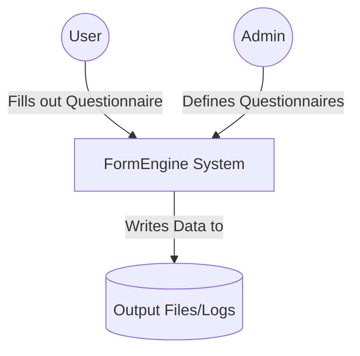
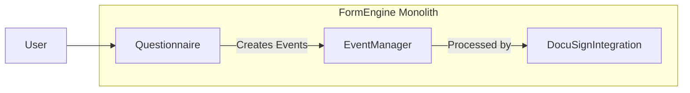
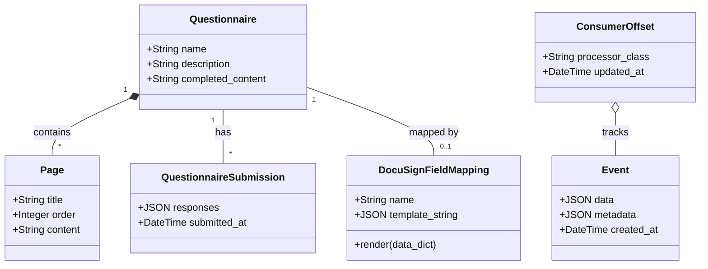
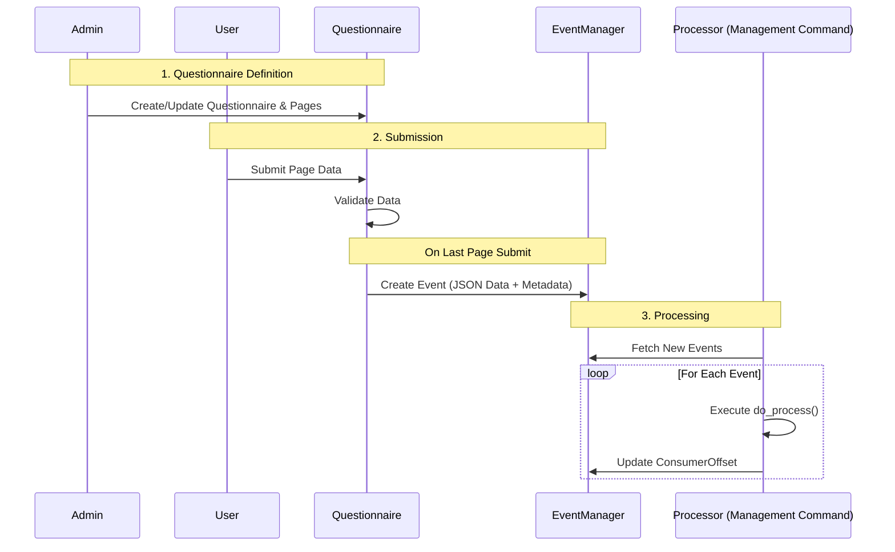

# FormEngine Spike Experiment

How to capture a typed form submission as an immutable event but also allow evolution of the form definition over time? How to support event driven audit log in a Django application?

---

This project is a spike experiment for a dynamic form engine using event sourcing. It allows for dynamic questionnaire creation, JSON-based event capture, and asynchronous event processing.

## Architecture (C4 Model Style)

### Level 1: System Context
The FormEngine system allows Users to fill out dynamic questionnaires. Submissions are captured as events, which are then processed by various Processors for downstream tasks (e.g., logging, integration with third-party services like DocuSign).

### Level 2: Containers
The system is built as a Django 'modulith' containing several primary Django Apps:

1.  **Questionnaire**: The user-facing application for defining and rendering multi-page forms.
2.  **EventManager**: The event store that records all submissions as immutable events.
3.  **DocuSignIntegration**: A processor that maps event data to DocuSign payloads.

---

## Django Apps & Data Models

### 1. Questionnaire
Responsible for the structure of questionnaires and rendering them using Jinja2 templates.

*   **Models**:
    *   `Questionnaire`: The top-level entity.
    *   `Page`: Individual pages of a questionnaire, containing Jinja2 template content.
    *   `QuestionnaireSubmission`: Records the raw JSON response of a submission.
*   **Key Logic**:
    *   Multi-page navigation and validation.
    *   Custom validators (e.g., `required`, `is_number`) defined in `views.py`.

### 2. EventManager
The backbone of the event-driven architecture.

*   **Models**:
    *   `Event`: An immutable record of a submission. Stores data and metadata as `JSONField`.
    *   `ConsumerOffset`: Tracks the last processed `Event` for each specific `Processor` class.

### 3. DocuSignIntegration
Provides integration with DocuSign by mapping form data to DocuSign payloads.

*   **Models**:
    *   `DocuSignFieldMapping`: Defines how submission data should be transformed into a DocuSign JSON payload using Jinja2 templates.
*   **Key Logic**:
    *   **DocuSignProcessor**: A specialized processor that renders the mapping's template using the event data and writes the result to a file (simulating an API call).

---

## Data Flow

1.  **Questionnaire Definition**: An admin creates a `Questionnaire` and its `Page`s in the Django Admin.
2.  **Submission**: A user fills out the questionnaire. On the final page submission:
    *   Data is validated.
    *   A `QuestionnaireSubmission` is created.
    *   An `Event` is created in the `EventManager` with the submission data.
3.  **Processing**: The `process_events` management command is executed:
    *   It identifies all active `Processor` subclasses.
    *   Each processor checks its `ConsumerOffset` for new events.
    *   For each new event, `do_process()` is called (e.g., `DocuSignProcessor` generates a JSON payload).
    *   The `ConsumerOffset` is updated.

---

## Technical Stack
*   **Language**: Python 3.13
*   **Framework**: Django
*   **Frontend**: HTMX (for multi-page form navigation), Jinja2 (for dynamic content)
*   **Database**: SQLite (default for spike)

## Future Roadmap (Todo)
* Only really supports one consumer rn. it's a POC.  
* Add transactions for consumers to ensure atomic processing and offset updates.
* Implement a dead-letter queue for failed events.
* Enhance consumer exception handling and retry logic.
* Integrate metrics and structured logging.
* Evaluate dedicated queue backends (e.g., `pgmq` or `pgqueuer`).
